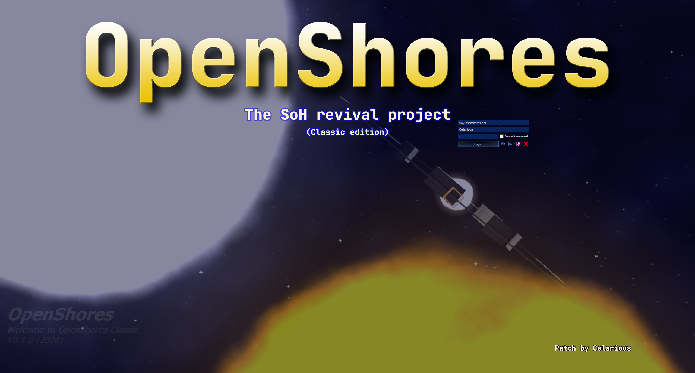

# What is this?
This repo is specifically for the 2016 (13m14, July 22 2016) SoH client. It is currently a WIP and **cannot connect to an OpenShores server**. 

# Why?
I found a copy of it on a Windows 7 HDD I recently recovered, and decided to try poking around with it too. This client was from before the new designer was added to the game in any capacity. Thus, the old designer is more stable. Other features such as the TL system, old city system, and inventory systems are also included.

# Notes
This does not initially compile with MSVC v140 (2015) and Qt5.5.1. This is because qcompilerdetection.h detects MSVC 2015 and defines Q_COMPILER_REF_QUALIFIERS which overloads its toUtf8() function with the ref-qualified versions. However, the Qt5.5.1 MSVC2013 libraries (which the game was built with) were compiled with the non-ref-qualified version, and thus the function signature is different and an ABI error occurs when you try to compile as-is. To fix this, modify `\msvc2013_64\include\QtCore\qcompilerdetection.h` to always `#undef Q_COMPILER_REF_QUALIFIERS`. Alternatively, you can try to install VS2013 but this is easier.

Check out [notes](https://github.com/Celarious/OpenShores-2016-ClientMod/blob/main/docs/notes.md) for more details.

# Screenshot

# Extra
The non-classic 2018 version of this repo can be found at https://github.com/Celarious/OpenShores-2018-ClientMod
